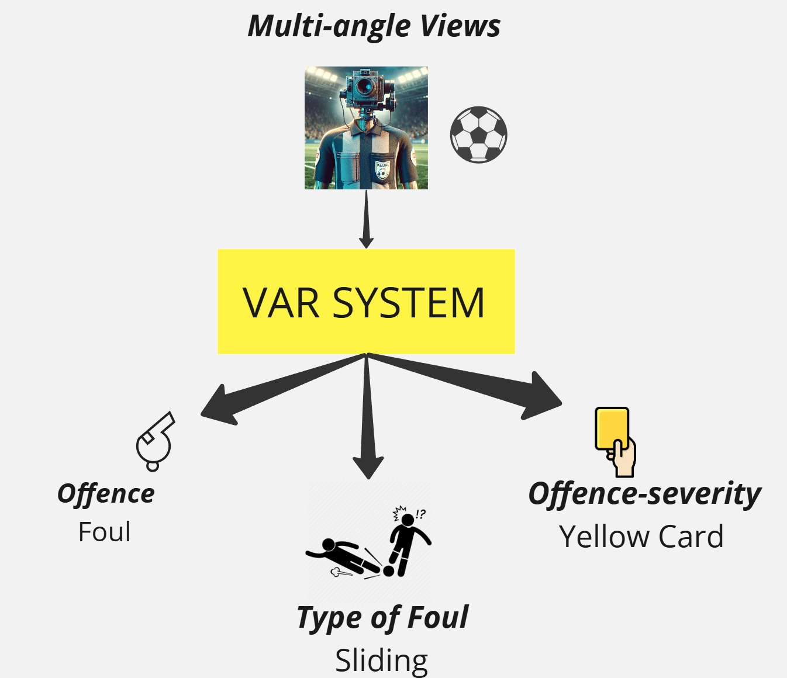
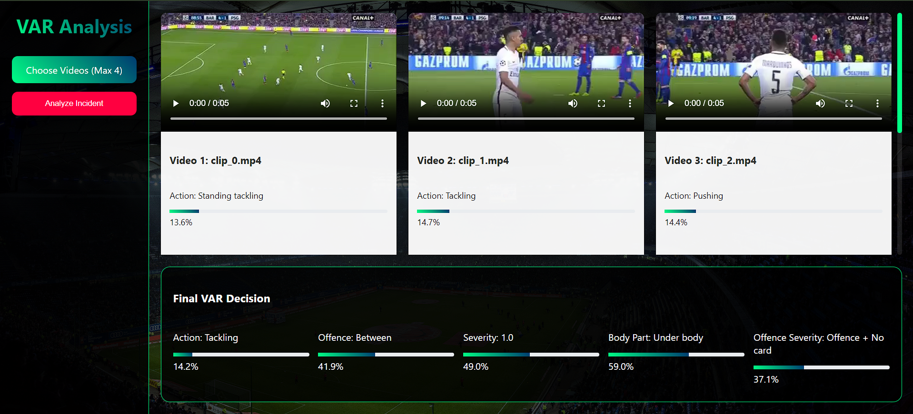

# VARify

This repository contains the code to train a multi-task AI model designed for Video Assistant Referee (VAR) applications in football. The model leverages a two-stream neural network architecture to analyze RGB and optical flow inputs, classifying various aspects of fouls, such as action type, offense severity, and body part involved.

<div align="center">
  
</div>

## Features

- **Two-Stream Neural Network**: Combines RGB and optical flow data for robust video analysis.
- **Multi-Class Classification**: Simultaneously predicts:
  - Action class (e.g., Tackling, Diving)
  - Offense type (e.g., Offense, No Offense)
  - Severity level (1 to 5)
  - Body part involved (Upper or Lower body)
  - Offense severity (e.g., No Card, Yellow Card, Red Card)
- **Customizable Training**: Supports adjustable parameters like batch size, learning rate, and number of epochs.
- **Data Preprocessing**: Includes utilities for loading and preprocessing video clips.

---

## Requirements

### Dependencies
The codebase uses Python and the following libraries:
- `torch`
- `torchvision`
- `numpy`
- `opencv-python`
- `Pillow`
- `tqdm`
- `scikit-learn`

Install dependencies using:
```bash
pip install -r requirements.txt
```

---
## SoccerNet-MVFoul

Follow the [link](https://pypi.org/project/SoccerNet/) to easily download the SoccerNet pip package.

If you want to download the data and annotations, you will need to fill a [NDA](https://docs.google.com/forms/d/e/1FAIpQLSfYFqjZNm4IgwGnyJXDPk2Ko_lZcbVtYX73w5lf6din5nxfmA/viewform) to get the password.

Then use the below command to install the dataset by updating the `password` variable in code:

```
python dataloader.py
```

To obtain the data in 720p, add version = "720p" to the input arguments. Unzip each folder while maintaining the naming conventions. (Train, Valid, Test, Chall). If you face issues extracting data from the train_720p.zip folder, the error may come from using the default unzip extractor. Using the app "The Unarchiver" should enable you to unzip it successfully.

The dataset consists of 3901 available actions. Each action is composed of at least two videos depicting the live action and at least one replay. The dataset is divided into a training set (2916 actions), validation set (411 actions), test set (301 actions) and challenge set (273 actions without the annotations).


## Dataset

The model uses the SoccerNet dataset or similar datasets containing annotated football match clips. Ensure the dataset is structured as follows:

```
mvfouls/
├── train/
│   ├── annotations.json
│   ├── action_1/
│   │   ├── clip_0.mp4
│   │   ├── clip_1.mp4
│   ├── ...
├── valid/
│   ├── annotations.json
│   ├── ...
├── test/
│   ├── annotations.json
│   ├── ...
```

Annotations should include:
- Action class
- Offense type
- Severity level
- Body part involved
- Offense severity

---

## How to Use

### 1. Data Preparation
Download and extract the SoccerNet dataset or your custom dataset. Update the `data_path` variable in the code to point to your dataset directory.

### 2. Training the Model
Run the training script using:
```bash
python train.py
```

You can customize training parameters such as:
- Number of epochs (`num_epochs`)
- Batch size (`batch_size`)
- Learning rate (`learning_rate`)
- Max Samples (`max_samples_o`, `max_samples_no`)

Example:
```python
main(data_path='mvfouls', num_epochs=40, batch_size=4, learning_rate=1e-3, max_samples_o=500, max_samples_no=400)
```

### 3. Model Architecture

The model is implemented in `model.py` using PyTorch. It consists of:
- Two ResNet50 backbones (one for RGB and one for optical flow).
- Fully connected layers for each classification task.

### 4. Preprocessing

The preprocessing pipeline in `preprocess.py` includes:
- Resizing frames to $$112 \times 112$$
- Normalizing RGB frames using ImageNet statistics.
- Computing optical flow using Farneback's method.

### 5. Evaluation

After training, the best model is saved as `best_model.pth`. Use this model for inference or further evaluation on the test set.

---

## Project Structure

```
VAR/
├── Interface/          # Interface for using the trained model
│   ├── ui.py           # FastAPI-based web interface
│   ├── model.py        # Model loading and inference logic
│   ├── best_model.pth  # Trained model weights
├── varfoul/            # Model training and preprocessing scripts
│   ├── train.py        # Training script for the model
│   ├── model.py        # Two-stream neural network architecture
│   ├── preprocess.py   # Preprocessing pipeline for RGB and optical flow inputs
```

---

## Example Outputs

During training, the script logs:
1. Training loss and accuracy per epoch.
2. Validation loss and accuracy per epoch.
3. Saves the best-performing model automatically.

---

## Customization

### Adjusting Frame Count
1. Modify `DESIRED_FRAME_COUNT` in `preprocess.py` to change the number of frames used per clip.
2. Modify `num_views` in `preprocess.py` to change number of views per action.

### Adding New Tasks
To add new classification tasks:
1. Update the `TwoStreamNetwork` class in `model.py`.
2. Modify labels in `preprocess.py`.
3. Update training logic in `train.py`.

---

# VARify UI

This section focuses on the implementation of the interactive interface for the VARify system. The interface allows users to upload football match video clips and obtain predictions for various foul-related classifications, such as action type, offense severity, and body part involved.

<div align="center">
  
</div>

### Interface Overview
The interface is built using FastAPI, providing a simple web-based platform for interacting with the trained VARify model. Users can upload video files, and the system processes them using the trained model to return predictions.

Download the weights of the model: https://drive.google.com/drive/u/0/folders/1aLEd2oMR30rEDBYSFFUs2s15OG047j61 or paste the trained model in the `Interface` folder.

And save the best_model.pth file in the folder `Interface`.


### 1. Running the Interface

To launch the interactive interface:
1. Navigate to the `Interface` directory.
2. Run the FastAPI server:
   ```bash
   python ui.py
   ```
3. Open your browser and go to `http://127.0.0.1:8000`.

### 2. Uploading Videos

The interface allows you to upload video clips for analysis. Once uploaded, the system will process the video using the trained model and return predictions for:
- Action class
- Offense type
- Severity level
- Body part involved
- Offense severity

**Note**: Upload upto 4 video clips through a web interface and get predictions in real time.

---

## Interface Details

The `Interface` folder contains:
- **`ui.py`**: Implements a FastAPI-based web application for uploading videos and returning predictions.
- **`model.py`**: Loads the trained model (`best_model.pth`) and performs inference.
- **`best_model.pth`**: Pre-trained weights of the two-stream neural network.

### Example API Endpoints

1. **Homepage**
   ```http
   GET /
   ```
   Returns an HTML page with instructions.

2. **Upload Endpoint**
   ```http
   POST /upload/predict_multiple
   ```
   Accepts a video file as input and returns predictions.

---

## Example Outputs

When running inference on a video clip through the interface or directly using `model.py`, you will receive outputs like:

```json
{
    "action_class": "Tackling",
    "offense_type": "Yes",
    "severity_level": "3",
    "body_part": "Upper body",
    "offense_severity": "Yellow card"
}
```

---

## Customization

### Adding New Tasks or Classes

To add new tasks or classes:
1. Update `TwoStreamNetwork` in `varfoul/model.py`.
2. Modify label mappings in `EVENT_DICTIONARY` in `Interface/ui.py`.
3. Adjust preprocessing logic in `preprocess.py`.

---
## Experiments 

If you would like to explore and understand more about different model implementations, please refer to `notebooks` folder. 

---

## Future Improvements

Potential enhancements include:
1. Improving real-time processing speed.
2. Incorporating advanced optical flow algorithms.

---

## Individual Contributions 

### Contributor 1: Jainil K. Rana (300362571)
#### Responsibilities:
1. **UI Development**:
   - Designed and implemented the **FastAPI-based web interface** for the VAR system.
   - Developed endpoints for video upload, preprocessing, and generating predictions from trained models.
   - Integrated the **MViT**, **ResNet R3D-18**, and **TwoStreamResNet** models into the interface for real-time foul classification.
   - Ensured smooth interaction between the backend and the trained models.

2. **Model Training - MViT**:
   - Trained the **Multi-scale Vision Transformer (MViT)** model for multi-task foul classification.
   - Fine-tuned hyperparameters such as learning rate, batch size, and dropout to optimize performance.
   - Evaluated MViT's performance on tasks like action classification, offense detection, and severity assessment.

### Contributor 2: Omkar P. Harkare (300359531)
#### Responsibilities:
1. **Model Training - ResNet R3D-18**:
   - Trained the **ResNet R3D-18** model for multi-task classification using spatiotemporal video data.
   - Implemented data preprocessing pipelines, including frame resizing and normalization.
   - Evaluated ResNet's performance across tasks like body part detection and offense severity classification.

2. **Model Training - TwoStreamResNet**:
   - Trained the **TwoStreamResNet** model by combining RGB and optical flow streams.
   - Handled feature extraction from both streams using ResNet-50 backbones.
   - Tuned task-specific fully connected layers for action recognition, severity assessment, and offense detection.

3. **Dataset Preparation**:
   - Processed the SoccerNet-MVFoul dataset, ensuring balanced class distributions for training.
   - Computed optical flow using Farneback's method and prepared data for multi-task learning.

---

## Citations:

- [1] [SoccerNet](https://soccer-net.org)  
- [2] [sn-mvfoul](https://github.com/SoccerNet/sn-mvfoul)
- [3] [SoccerNet-MLV](https://github.com/csjihwanh/soccernet-MLV)

If you use this code or parts of it in your research or projects, please cite appropriately.
